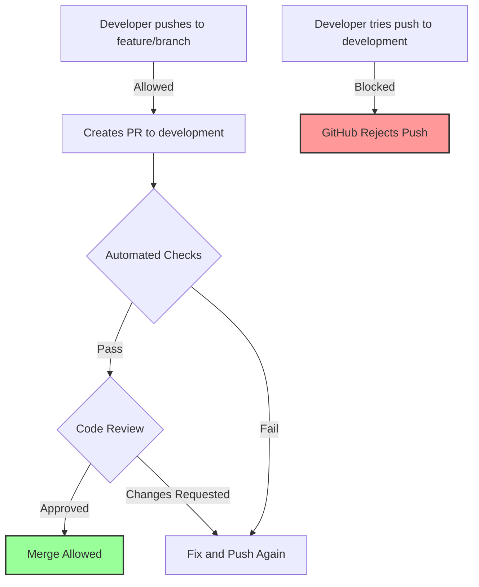

# Branch Protection Setup Guide

This guide shows how to configure branch protection rules to enforce the CI/CD workflow.

## Why Branch Protection Matters

Branch protection **enforces** your workflow:
- ❌ **Without it**: Rules are suggestions, anyone can bypass
- ✅ **With it**: Rules are mandatory, GitHub blocks violations

## Branch Protection by Environment

### 🛡️ Main Branch (Production)

**Settings → Branches → Add rule → Branch name pattern: `main`**

✅ **Require a pull request before merging**
- Require approvals: `2` (for production changes)
- Dismiss stale pull request approvals when new commits are pushed
- Require review from CODEOWNERS: ✓ (optional)

✅ **Require status checks to pass before merging**
- Require branches to be up to date before merging
- Status checks required:
  - `lint-and-format`
  - `sdlc-standards`
  - `security-scan`
  - `unit-tests`
  - `build-validation`
  - `pre-release-validation`
  - `final-tests`

✅ **Require conversation resolution before merging**

✅ **Include administrators** (even admins must follow rules)

✅ **Restrict who can push to matching branches**
- Add specific users/teams who can merge to production

✅ **Rules applied to everyone including administrators**

---

### 🔧 Development Branch

**Settings → Branches → Add rule → Branch name pattern: `development`**

✅ **Require a pull request before merging**
- Require approvals: `1`
- Dismiss stale pull request approvals when new commits are pushed

✅ **Require status checks to pass before merging**
- Status checks required:
  - `lint-and-format`
  - `sdlc-standards`
  - `security-scan`
  - `unit-tests`
  - `build-validation`

✅ **Require branches to be up to date before merging**

✅ **Include administrators**

---

### 🧪 UAT Branch

**Settings → Branches → Add rule → Branch name pattern: `uat`**

✅ **Require a pull request before merging**
- Require approvals: `1` (QA team member)

✅ **Require status checks to pass before merging**
- Status checks required:
  - `qa-validation`
  - `integration-tests`
  - `performance-tests`
  - `security-validation`

✅ **Include administrators**

---

## How Protection Enforces the Workflow

### Scenario 1: Developer Tries Direct Push ❌

```bash
git checkout development
echo "bypass" >> src/calculator.py
git commit -am "Quick fix"
git push origin development

# GitHub Response:
# remote: error: GH006: Protected branch update failed
# remote: error: Changes must be made through a pull request.
```

### Scenario 2: PR with Failing Tests ❌

```yaml
PR Check Results:
✅ lint-and-format
✅ sdlc-standards  
❌ unit-tests        # FAILED
✅ security-scan
✅ build-validation

GitHub Status: "This branch cannot be merged"
Merge button: DISABLED
```

### Scenario 3: PR Without Review ❌

```yaml
All checks: ✅ PASSED
Reviews: 0 of 1 required

GitHub Status: "Review required"
Merge button: DISABLED
```

### Scenario 4: Everything Correct ✅

```yaml
All checks: ✅ PASSED
Reviews: 1 of 1 approved ✓

GitHub Status: "Ready to merge"
Merge button: ENABLED (green)
```

---

## Setting Up Status Checks

After your first workflow run, the status checks become available:

1. **Run workflows first**: Push code to trigger workflows
2. **Wait for completion**: Let workflows finish once
3. **Return to branch protection**: Settings → Branches
4. **Search for checks**: Start typing in the search box
5. **Select all required checks**: They appear after first run

---

## Protection in Action

### Developer Workflow with Protection



---

## Common Issues and Solutions

### "I can't find my status checks"

**Solution**: The checks only appear after they've run at least once. Create a test PR to trigger them.

### "Merge button is disabled but everything is green"

**Check**:
1. Is branch up to date? (Pull latest changes)
2. Are conversations resolved?
3. Do you have required approvals?

### "I need to merge urgently"

**Emergency bypass** (with admin rights):
1. Settings → Branches → Edit rule
2. Temporarily disable protection
3. Merge
4. **IMMEDIATELY re-enable protection**
5. Document why in merge commit

---

## Best Practices

1. **Start Strict**: It's easier to relax rules than tighten them
2. **Communicate Changes**: Tell team before changing rules
3. **Document Exceptions**: If you bypass, document why
4. **Regular Reviews**: Review rules quarterly
5. **Different by Environment**:
   - Development: Balance speed and safety
   - UAT: Focus on quality
   - Production: Maximum protection

---

## Testing Branch Protection

After setup, test each branch:

### Test Development Protection
```bash
# This should fail
git checkout development
touch test.txt
git add . && git commit -m "test"
git push  # Should be rejected

# This should work
git checkout -b feature/test
git push -u origin feature/test
# Create PR on GitHub
```

### Test Main Protection
- Try to merge a PR without reviews (should fail)
- Try to merge with failing checks (should fail)
- Get approval and pass checks (should work)

---

## Impact on Workflow

With protection enabled:

| Action | Without Protection | With Protection |
|--------|-------------------|-----------------|
| Push to main | ⚠️ Allowed | ❌ Blocked |
| Merge PR without tests | ⚠️ Allowed | ❌ Blocked |
| Merge PR without review | ⚠️ Allowed | ❌ Blocked |
| Skip CI/CD | ⚠️ Possible | ❌ Impossible |
| Accountability | 😐 Low | 💯 High |

---

## Summary

Branch protection transforms your CI/CD from:
- **"Please follow the process"** → **"You must follow the process"**
- **Optional quality gates** → **Mandatory quality gates**
- **Trust-based** → **Enforcement-based**

This ensures consistent quality and prevents accidental or intentional bypassing of your carefully designed workflow! 